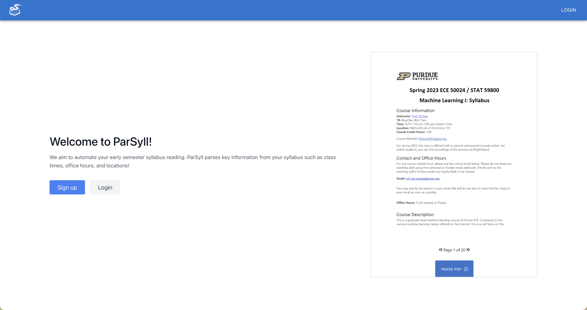
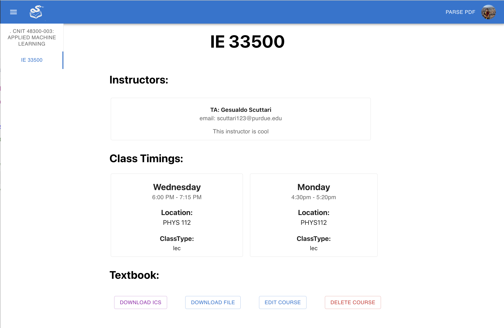

# Parsyll
We aim to automate your early semester syllabus reading through an easy-to-access dashboard. ParSyll parses key information from your syllabus such as class times, instructor information, locations and more!

Goals:
- Allow students to upload their syllabus and generate a downloadable calendar.
- Display important information about instructor and course.

Our main functionalities:
- Drop pdf for parsing
- Download pdf after parsing
- Add/Edit fields to keep consistent with course
- Easy access to all courses of the syllabus you have parsed

## 1. Running Parsyll
**NOTICE: YOU MUST HAVE YOUR OWN ENV FILE TO RUN THE PROJECT**
### 1.1 Content of ENV file
* Env in /react-frontend should include:
  * REACT_APP_PARSEAPP_URL (URL of backend)
* Env in /backend/src/parsyll_fastapi should include:
  * JWT_SECRET (Secret to sign JWT Tokens)
  * JWT_ALGORITHM (JWT signing algorithm)
  * FIREBASE_SERVICE_ACCOUNT (Firebase account to use firebase SDK)
  * FIREBASE_CONFIG (For Firebase SDK)
  * OPENAI_API_KEY (OpenAI key to use OpenAIs developer API)
 
### 1.2 Two ways of running parsyll locally:
* (**With Docker**) Run `docker-compose up && docker-compose rm -fsv` where the docker-compose file is located in the main directory.
* (**Without Docker**) 
    *  **Frontend**: `cd` into */react-frontend*, run `npm install` and then `npm start`.
    *  **Backend**: `cd` into *backend/src/parsyll_fastapi/*, run `pip install -r requirements.txt` and then `python3 main.py`.

## 2. Screenshots of Parsyll

### 2.1 Homepage
This is where the user is greeted and prompted to login.

### 2.2 Course Dashboard
This is a preview of the Dashboard that the user will have once they have populated the dashboard.

### 2.3 PDF drop zone
This is a preview of where the user can drop their pdf for parsing.

## 3. Links:
* [Running instance of Parsyll](http://ec2-18-212-172-90.compute-1.amazonaws.com/)
* [Dockerhub of image of frontend](https://hub.docker.com/repository/docker/werunm/parsyll_react_frontend/general)
* [Dockerhub of image of backend](https://hub.docker.com/repository/docker/werunm/parsyll_fastapi_backend/general)
* [FastAPI backend documentation](http://ec2-52-23-239-84.compute-1.amazonaws.com/docs)

## 4. Licensing
We chose MIT license as our project is geared towards Purdue University. We would like our project to be open-sourced and widely adapted by other universities, hence we would want our project to be easily distributed to other students who would like to adpot this project to their university. MIT is a more permissive license while limiting the liability that we have, and since this was our senior design project, this is a hastily completed projects by undergraduate students, it is possible that this project consists of breaking-bugs or security issues that are overlooked.
